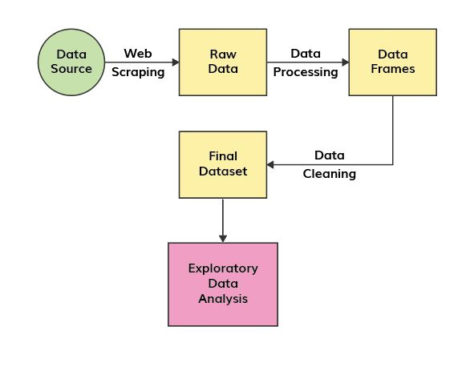

```{r setup, include=FALSE}
knitr::opts_chunk$set(echo = TRUE)
knitr::opts_chunk$set(warning = FALSE, message = FALSE) 
```

## Introduction

Olympics is considered as one of the most prime platforms for the players across the countries all over the world to showcase their talents. Athletes becomes pride of their countries, more importantly, being icon of great inspiration to the young generation.

The first ancient Olympics games were held in Olympia, Greece at 776 BC as a part of some religious festival and it continued till 393 AD in every four years at different cities of Greece. After almost 1500 years it reappeared at 1896, which was the first modern Olympic games held at Athens, Greece. Since then every four years, the biggest festival of sports is celebrated at different corners of the world. Thus being enriched with glorious history, it becomes more than some multi-sport championship. For years, people are trying to scrutinize the games under the lens to understand global history including geopolitical dynamics, evolution of human society, women empowerment etc.

## Motivation and Proposed Approach

Various scenarios comes to our mind when we look into evolution of Olympic Games over the years like increase in participation of countries, increase/decrease in number of events, improvement of performances, participation ratio of men and women. In this project, the target is to analyze that history of olympics to find possible answers of how different factors contributes to the result of the games over years. To determine these factors and perform a comparative study on these factors, following steps are followed. We try to show them in a flowchart.


```{r, echo=FALSE, out.width="50%", fig.cap="Flowchart of work", fig.align = 'center'}

```
## Data Source

In order to perform analysis we require a large amount of data on which we can apply various techniques to reach to a particular conclusion. Earlier we wanted to scrape the data from the official website of Olympics, but it created some issue by blocking the user to access their website html for scraping. So we have used another [website](olympedia.org). This website consists the information about the players and their entire details like their Gender,Height, Weight, Country for which they play, Medals won (Gold, Silver and Bronze) and many more. These data are used analyze the performance of players over the year and for each event of one particular year. We have collected data only on last 10 summer Olympics, i.e. from Los Angeles 1984 to Tokyo 2020. Also we collected data on GDP of every countries from [this website](https://www.macrotrends.net/countries/ranking/gdp-gross-domestic-product). This dataset consists each country code,and GDP of that particular country over the years.


## Data Scraping 

#### Required Libraries
\
To scrape the data from [olympedia.org](olympedia.org) some libraries are required such as :

  * rvest
  * tidyverse
  * eeptools
  * lubridate
  * stringi
```{r , echo=FALSE}
library(rvest)
library(tidyverse)
library(eeptools)
library(lubridate)
library(stringi)
```
### Web Scraping : Steps

#### Scraping for list of medal winners
\

* First load the  website [olympedia.org](olympedia.org) in R.

* Select years from 1984 to 2020 except three youth Olympics such as Singapore 2010, Nanjing 2014, Buenos Aires 2018.
```{r , echo=FALSE}
#main page 
html1 = read_html('http://www.olympedia.org/editions/medals')

#ids for modern olymic summer games
id = (html1 %>% html_elements('.table.table-striped a') %>% html_attr('href'))[320 : 332]

rm_index <- c(8,10,12)

id <- id[-rm_index]
```

* Create the url link based on the unique ID of each Olympics, like this : 
```{r,echo = FALSE}
#creating url for individual games
url = paste('http://www.olympedia.org',id,sep = '')
head(url)
```

* Now we find the **country codes** and **country names** of those countries which won the medals at least once.

```{r,echo=FALSE}
#all countries which have won atleast one medal in any olympic
html_country = read_html('http://www.olympedia.org/statistics/medal/country')

## List all the country name with their corresponding codes
country_with_codes = (html_country %>% html_elements('td a') %>% html_text())

## Name of the countries
country = country_with_codes[seq(1,length(country_with_codes),2)]
```

* A  function was created to accumulate the details of each of the olympic, one at a time.\

Using `html_table()` we got a table like this.  

```{r,echo=FALSE}
url = url[1]
html <- read_html(url)
  
data_table <- (html %>% html_table())[[1]]
head(data_table)
```
* Equating the **first two columns of the table** we can find the name of the main events.Repeat each event name suitable number of times to arrange the dataframe properly. After that we make a separate column for subevents.
      
```{r,echo=FALSE, include=FALSE}
### First find the index of the main event name of each game
index = which(data_table$X1 == data_table$X2) 
### Then find the name of that event using those indices
olympic_events = data_table$X1[index]
#arranging the event names to add to the dataframe, repeating each name suitable number of times
index_1 = c(index, nrow(data_table) + 1)
## Create a empty vector to repeat the name of the main events
events = c()
for(i in 1 : length(index)){
    events = c(events, rep(olympic_events[i], diff(index_1)[i] - 1))
}
  
#rest of the dataframe containing the subevents details
olympic_subevents = data_table[-c(1,index),]
head(olympic_subevents)
```
* Now to identify the type of each games, in the medal winners list in the initial dataframe, if there is a country name then that event is a *team event* otherwise it is an *individual event*. One column is added to it to list down the type of medals (Gold, Silver, Bronze) won by the players.

``` {r,echo=FALSE}

  # In the 2nd,4th and 6th column of olympic_Subevents dataframe, some countries
  # are followed by some numbers which needs to be removed
  olympic_subevents$X2 = gsub("[[:digit:]]", "", olympic_subevents$X2) %>% str_trim()
  olympic_subevents$X4 = gsub("[[:digit:]]", "", olympic_subevents$X4) %>% str_trim()
  olympic_subevents$X6 = gsub("[[:digit:]]", "", olympic_subevents$X6) %>% str_trim()
  
  
  # In 'olympic subevents' dataframe we are looking into gold winners column
  # if there is a country name, the event is a team event, otherwise individual event
  genre = ifelse(is.na(match(olympic_subevents$X2, country)) == T, 'individual', 'team')
  
  #first attempt of dataframe to aggregate events, subevents and their types
  data_1 = data.frame(events, olympic_subevents$X1, genre)
  # To give the name of each column name
  colnames(data_1) = c('Events', 'Sub Events', 'Type')
  
  medal = c('gold', 'silver', 'bronze')
  data_2 = data.frame(data_1[rep(seq_len(nrow(data_1)), each = 3),], medal)
  head(data_2)
```

* Name of individual players and their countries are listed down from the initial table. On the other hand, for the team events, put **NA** in corresponding rows.
```{r,echo=FALSE}
 #attempts to extract individual players name and corresponding countries
  A <- olympic_subevents[,c(2,4,6)] 
  B <- as.data.frame(t(A))
  html_medal <- (stack(B))$values
  index1 <- which(data_2$Type == "team") ## Identify which are team events
  html_medal[index1] = NA   ## Assign NA to the team events
  ## Extract the country codes from "olympic_subevents" from the 3 rd 5 th and 7th column
  html_country_code <- (olympic_subevents[,c(3,5,7)] %>% t() %>% as.data.frame() %>% stack())$values
  
  ## Make a new data frame with html_medal and html_country_code
  data_3 = data.frame(data_2,html_medal,html_country_code)
  row.names(data_3) = 1 : nrow(data_3)
```

* Here, a big issue occurred in case of presence of *joint winners* in an event. If there are joint winners, the names and their country codes have been joined together in the inital table. Since, country codes are always of 3 letters, they could be easily handled by separating each group of 3 letters. To seperate the names of the players, a pattern was followed initially - *a small alphabet followed by a capital alphabet.* But there were several exceptions of this pattern, like - 

  - In many cases, names contain some alphabets of their own languages. These letters were listed seperately and another condition was added to the pattern to take care of them.
  - In some cases, names itself contained a small letter followed by a capital letter (e.g. *Julianne McNamara*). These cases had to handle manually.

* After seperating the names and countries of the joint winners they had to be appended in proper position of rows in the dataframe. \

Thus names and countries of all medal winners were listed .

```{r,echo=FALSE}
 #### Working for joint winners
  # Identify which country_code contains 6 characters
  joint = which(nchar(data_3$html_country_code) > 3)
  
  # Copy all the columns of data_3 in data_4
  data_4 = data_3
  
  # Keep the first 3 characters for the 1st candidate of each joint winner
  data_4$html_country_code[joint] = substring(data_3$html_country_code[joint], first = 1, last = 3)
  
  #View(data_4)
  
  # Country_code for the second candidate of each joint winner
  # joint_country_code = substring(data_3$html_country_code[joint], first = 4) 
  
  l = nchar(data_3$html_country_code[joint])
  
  joint_country_seperation = c()
  for(i in 1 : length(joint)){
    joint_country_seperation = c(joint_country_seperation, 
                                 stri_sub(data_3$html_country_code[joint[i]],
                                          from = seq(4, l[i], 3),
                                          to = seq(6, l[i], 3)))
  }
   ## Collect the unique letters
  un_let = (strsplit(data_3$html_medal, split = '')) %>% unlist() %>% unique()
  ## Remove special characters from those set of unique letters
  not_Spcl = c(" ", '-', "'",NA,'—')
  ## Collect only the special letters
  spcl = un_let[! (un_let %in% c(letters,LETTERS,not_Spcl))]
  
  ## Split each name of the joint winner
  words = strsplit(data_3$html_medal[joint], split = '')
  
  # Create a empty vector
  final_names_together = c()
  
  ## Add ";" between joint winners to split their names
  for(i in 1 : length(words)){
    for(j in 1 : length(words[[i]])){
      if(words[[i]][j] %in% letters & words[[i]][j+1] %in% LETTERS | 
         words[[i]][j] %in% spcl & words[[i]][j+1] %in% LETTERS){
        words[[i]] = append(words[[i]], ';', after = j)
      }
    }
    final_names_together[i] = paste(words[[i]], collapse = '')  
  }
  
  
  final_names_together[final_names_together == 'NA'] = NA

   ## Add NA where NA appears
  NA_index = which(is.na(final_names_together) == T)
  
  if(length(NA_index) > 0){
    r <- nchar(data_3$html_country_code[joint[NA_index]])/3
    ## Split the names based on that ";"
    final_names_NA = c()
    i = 3
    for(i in 1:length(NA_index))
    {
      final_names_together =  append(final_names_together, rep(NA,r[i]-1), after = NA_index[i])
      NA_index[i+1] = NA_index[i+1] + i
    }
    
    final_names = unlist(strsplit(final_names_together,split = ";",fixed = TRUE))
  }else{
    final_names = unlist(strsplit(final_names_together,split = ";",fixed = TRUE))
  }
  
  if(length(which(final_names == "Namara"))>0){
    final_names[which(final_names == "Namara") - 1] = paste(final_names[which(final_names == "Namara") - 1], 'Namara',sep = '')
    final_names = final_names[-which(final_names == "Namara")]
  }
#creating a sequence to catch the first joint winner name
  s = cumsum(c(1,l/3))
  s = s[-length(s)] 
  
  s1 = cumsum(c(1,l/3 - 1))
  s1 = s1[-length(s1)]
  
  data_4$html_medal[joint] = final_names[s]
  
  ## Copy the data of data_4 to data_5
  data_5 = data_4
  
  d = cumsum(diff(s)-1)
  
  joint1 = joint
  
  #appending new rows for joint winners
  for (i in 1 : length(joint1)){
    for(j in 0 : (l[i] / 3 - 2)){
      data_5 = data_5 %>% add_row(Events = data_5$Events[joint1[i]],
                                  Sub.Events = data_5$Sub.Events[joint1[i]],
                                  Type = data_5$Type[joint1[i]],
                                  medal = data_5$medal[joint1[i]],
                                  html_medal = (final_names[s[i]+j+1]),
                                  html_country_code = joint_country_seperation[s1[i] + j],
                                  .after = joint1[i] + j)
    }
    joint1[i+1] = joint1[i+1] + d[i]
  }
  head(data_5)
```

#### Scraping for details of individual players
\

* In the website, the players' name were hyperlinked with the pages containing their personal details and history of medal winnings. 
  - **Age Calculation : ** In each pages, Date of birth are given for each players. Using that, age of the players were calculated in the year of the corresponding Olympics. Some discrepencies had to be sorted during this, like : 
    + Some DOB was along with their birth places, from which dates were seperated.
    + Some DOB didn't have the day, only months and years were available. We considered the day 1 of the corresponding months in these cases.
  - **Height and Weight : ** Heights and weights of the players was given in a single line under 'Measurements'. Those had to be separated and units had to be removed to get the numerical values of the measurements.
\

Following all of the above steps, 10 dataframes were created, one for each Olympics.
Here is a glimpse of one of the final tables.

```{r, echo=FALSE}
load('full_df.Rdata')
head(data1)
```

#### Scraping for GDP Data
\

* First go to the [GDP website](https://www.macrotrends.net/countries/ranking/gdp-gross-domestic-product)
From this website, the country codes were screpd and using those go to the website of each of them.
* Data on GDP was collected only for the years of last 10 summer Olympics (1894 - 2020).
* Finally, from the previous data on medal winners, data on numbers of medals won by each countries are collected and attached to this dataframe on GDP. 
\
The data looks like this : 

```{r, echo=FALSE}
load('GDP_final_data.Rdata')
head(GDP_data[,-c(4,7,8)])
```

## Some Key Questions

The purpose of our analysis is to answer some, if not all, of the interesting questions like this : 

1. Which countries dominate in which Olympic Sports?
2. Which factors affect the total number of medals won by different countries?
3. Does the Olympic games show gender equality?
4. How does age of a player impact winning a medal in Olympics?
5. What is the effect of Height and Weight to win a medal in different games?
6. How is GDP of a country related to number of medals won by a country?
7. How have number of medals won by a country varied over the years?


## Visualizations and Analysis

To find the possible answers of the questions, we are using Exploratory Data Analysis technique. Exploratory Data Analysis (EDA) is *an approach of analyzing data sets to summarize their main characteristics, often using statistical graphics and other data visualization methods* (**Source : Wikipedia**). With the help of EDA we try to analyse the questions visually apart from applying any statistical tools. Varoius types of plots are used here to explain things. Some of them are - 

  * Scatter Plot
  * Bar Diagram
  * Density plot
  * Box Plot
  * Dot Chart 
  * Plot on world map etc.

### Plot of Medal Distribution over Years

#### Plot on World Map
\
Our target is to plot the number of medals won by different countries over years using colors according to medal distribution. To do this first the dataset 'world' is loaded and a column is added to it which contains number of medals won by different countries in a particular year. Here is a glimpse of the dataset.

``` {r mapplot, echo = F}
library(ggplot2)

mapdata = map_data("world")
load('GDP_final_data.Rdata')
GDP_data_updated = GDP_data
GDP_data_updated$Country_Name[which(GDP_data_updated$Country_Name == 'United States')] = 'USA'  
GDP_data_updated$Country_Name[which(GDP_data_updated$Country_Name == 'Great Britain')] = 'UK'

map_ind = match(mapdata$region, GDP_data_updated[GDP_data_updated$Year == 2016,]$Country_Name)
    
mapdata$map_medal = GDP_data_updated[GDP_data_updated$Year == 2016,]$Medals[map_ind] 

(mapdata[12226:12230,])

```
Now to plot the world map based on the data, we need **geom_polygon** function from *ggplot2* package. Then on the map, colors are given according to number of medals on by different countries in that particular year. We get a plot as follows.

```{r mapplot2, echo=FALSE, fig.height=3.5, fig.width=6.5}
    library(ggplot2)
    ggplot(mapdata, aes(long, lat, fill = map_medal, group = group))+
      geom_polygon(colour = 'gray') + 
      scale_fill_continuous(low = "#f2d340",
                            high = "#6c1615",
                            guide = "colorbar")+
      labs(fill = 'No. of medals',
           title = 'Medal distribution of countries (Rio 2016)')
```


#### An Observation : Host Country Effect
\

We plot the above graph for the years 1992 and 2000.\

From the graph below, it is observed that the medal distribution of Australia had increased significantly from 1992 to 2000. Now, in 2000, the host country was Australia, and that is the probable reason of this drastic increase as there was a significant improvement of infrastructure and huge increase in investment to arrange the events. This is known as **Host Country Effect**.

```{r mapplot3, echo=FALSE, fig.height= 7}
mapdata = map_data("world")
load('GDP_final_data.Rdata')
GDP_data_updated = GDP_data
GDP_data_updated$Country_Name[which(GDP_data_updated$Country_Name == 'United States')] = 'USA'  
GDP_data_updated$Country_Name[which(GDP_data_updated$Country_Name == 'Great Britain')] = 'UK'
    


library(ggplot2)
library(patchwork)
map_ind1 = match(mapdata$region, GDP_data_updated[GDP_data_updated$Year == 1992,]$Country_Name)
mapdata1 = mapdata 
mapdata1$map_medal = GDP_data_updated[GDP_data_updated$Year == 1992,]$Medals[map_ind1] 
      g1 = ggplot(mapdata1, aes(long, lat, fill = map_medal, group = group))+
      geom_polygon(colour = 'gray') + 
      scale_fill_continuous(low = "#f2d340",
                            high = "#6c1615",
                            guide = "colorbar")+
      labs(fill = 'No. of medals',
           title = "Barcelona 1992")
map_ind2 = match(mapdata$region, GDP_data_updated[GDP_data_updated$Year == 2000,]$Country_Name)
mapdata2 = mapdata 
mapdata2$map_medal = GDP_data_updated[GDP_data_updated$Year == 2000,]$Medals[map_ind2] 
      g2 = ggplot(mapdata2, aes(long, lat, fill = map_medal, group = group))+
      geom_polygon(colour = 'gray') + 
      scale_fill_continuous(low = "#f2d340",
                            high = "#6c1615",
                            guide = "colorbar")+
      labs(fill = 'No. of medals',
           title = "Sydney 2000")
g1/g2+plot_annotation(title = 'Plot of medal distribution')
```


\
\

#### Plot of medal distribution over different events in an Olympic
\

To show number of medals won by the players in different events in a particular olympic we draw a *Stacked Bar Diagram.* In every bar, different types of medals (Gold, Silver, Bronze) are shown by different colors. Here is the plot.

```{r medalplot, echo = F, fig.width= 11, fig.height=5}
load('all_data_list.Rdata')
g <- ggplot(all_data[[10]], aes(Events)) + scale_fill_brewer(palette = "Spectral")
    
    g + geom_histogram(aes(fill=Medal), 
                       stat = "count",
                       col="black", 
                       size=.1)+
      labs(y = "Medal",
           x='') + 
      theme(axis.text.x = element_text(angle = 30, vjust = 0.5, hjust=1))+
      labs(title = 'Plot of medal distribution in different events (Tokyo 2020)')
```

### Plots on Gender Distribution
\
To show the gender distribution among the medal winners in an Olympic, another *Stacked Bar Diagram* was plotted for each of the Olympics. In each bar, Number of Male and Female medal winners are denoted by different colors. The plot is as follows.

```{r genderplot1, echo = F,fig.width= 9, fig.height=4.5}
load('all_data_list.Rdata')
g <- ggplot(all_data[[9]][all_data[[9]]$Type == 'individual' & is.na(all_data[[9]]$Gender) == F,], aes(Events)) + scale_fill_brewer(palette = "Spectral")
    
    g + geom_histogram(aes(fill=Gender), 
                       binwidth = .1,
                       stat = "count",
                       col="black", 
                       size=.1)+
      labs(y = "count",
           x ='',
           title = 'Plot of gender distribution among medal winners in different events (Rio 2016)') + 
      theme(axis.text.x = element_text(angle = 30, vjust = 0.5, hjust=1))
```
\


#### Does Olympics show gender equality?
\
Gender inequality is a very alarming issue globally. Now, one can question whether Olympics is also affected with this. For this, we have to study the ratio of number of male and female participants of different countries in Olympics over the years.

Now, the issue with this study is that we only have data on the medal winners in different Olympics. So, it is not possible to study exact sex-ratio of different countries in the games. That's why, we tried to visualize this from a different point of View. We wanted to determine sex-ratio among the medal winners in different events in every Olympics. The data looks like this : 

```{r genderdata, echo=F}

library("data.table")
library('tidyverse')
load('full_df.Rdata')

gender_distn = data1 %>% 
  group_by(year, Events,Gender) %>% 
  summarize(count = length(Medal),.groups = 'drop') %>% 
  na.omit() %>% 
  tidyr::pivot_wider(names_from = Gender, 
                     values_from = count) 

gender_distn$Female[is.na(gender_distn$Female) == T] = 0
gender_distn$Male[is.na(gender_distn$Male) == T] = 0

gender_distn_final = gender_distn%>% 
  mutate(Ratio = Female/Male)

head(gender_distn_final)

```

Since, all the events more or less have 3 medal winners, be it a male or female event, the ratio should be 1 in most of the cases. But as it can be seen from the glimpse of the data that the ratio is not so, even there is some 0's and *inf*'s (i.e. no male/female medal winners) which only implies that there is not the equality in numbers of events for males and females in different events - inequality from the hosts themselves! Let's try to see this visually as well.

```{r genderplot2,echo=F, fig.height=6.8, fig.width=9.5}
library(ggplot2)
library(patchwork)

load('all_data_list.Rdata')
    
g1 = ggplot(all_data[[4]][all_data[[4]]$Type == 'individual' & is.na(all_data[[4]]$Gender) == F,], aes(Events)) + scale_fill_brewer(palette = "Spectral") + 
  geom_histogram(aes(fill=Gender), 
                       binwidth = .1,
                       stat = "count",
                       col="black", 
                       size=.1)+
      labs(y = "count",
           x ='',
           title = 'Atalanta 1996') + 
      theme(axis.text.x = element_text(angle = 30, vjust = 0.5, hjust=1))

g2 = ggplot(all_data[[10]][all_data[[10]]$Type == 'individual' & is.na(all_data[[10]]$Gender) == F,], aes(Events)) + scale_fill_brewer(palette = "Spectral") + 
  geom_histogram(aes(fill=Gender), 
                       binwidth = .1,
                       stat = "count",
                       col="black", 
                       size=.1)+
      labs(y = "count",
           x ='',
           title = 'Tokyo 2020') + 
      theme(axis.text.x = element_text(angle = 30, vjust = 0.5, hjust=1))
g1/g2+plot_annotation(title = 'Gender Distribution among medal winners in different events')
```
\
\
From the graph, it can easily be noticed that there was no female participation in case of physical games like **Boxing, Judo, Wrestling, Weightlifting** in 1996 Olympics, whereas in 2020, females are also actively participating in these events. So, there might be a decrease to the gender inequality issue in the games in recent years. Let's try to visualize this fact as well.

```{r genderplot3, echo=F, fig.width=10,  fig.height= 8}
g1 = ggplot(gender_distn_final[gender_distn_final$Events == 'Wrestling',],aes(year,Ratio))+
  geom_line()+
  geom_point()+
  scale_x_continuous(breaks = seq(1984,2020,4))+
  ylim(0,1)+
  labs(title = "Wrestling",
       y = 'Sex Ratio (F/M)')
g2 = ggplot(gender_distn_final[gender_distn_final$Events == 'Weightlifting',],aes(year,Ratio))+
  geom_line()+
  geom_point()+
  scale_x_continuous(breaks = seq(1984,2020,4))+
  ylim(0,1)+
  labs(title = "Weightlifting",
       y = 'Sex Ratio (F/M)')

g3 = ggplot(gender_distn_final[gender_distn_final$Events == 'Boxing',],aes(year,Ratio))+
  geom_line()+
  geom_point()+
  scale_x_continuous(breaks = seq(1984,2020,4))+
  ylim(0,1)+
  labs(title = "Boxing",
       y = 'Sex Ratio (F/M)')

g4 = ggplot(gender_distn_final[gender_distn_final$Events == 'Judo',],aes(year,Ratio))+
  geom_line()+
  geom_point()+
  scale_x_continuous(breaks = seq(1984,2020,4))+
  ylim(0,1)+
  labs(title = "Judo",
       y = 'Sex Ratio (F/M)')

(g1+g2)/(g3+g4)+plot_annotation(title = 'Sex-Ratio in Olympics over the years 1984-2020')

```

So, it is quite evident from the graphs that, the events are approaching towards achieving gender equality slowly over the years. Events like Weightlifting and Judo have completely achieved (fluctuations are due to discrepencies in the data collected), at least from the organizers' side, whereas there is still inequality in the games like Wrestling and Boxing.

### Plots on GDP
#### How is number of medal won by different countries depend on GDP over the years?
\
Now, if one looks into the medal tally of different Olympics over the years, one can only see the first-world countries like USA, UK, China always dominates the table. So, it is an interesting question whether GDP of a country somehow affects the medal count. 

To analyse this, scatterplots are drawn on number of medals won by a country with the corresponding GDP for different years. 
```{r GDPplot, echo=FALSE, fig.align='center', fig.width= 10, fig.height= 7}
library(ggplot2)
library(patchwork)
load('GDP_final_data.Rdata')
    new_dat1 <- subset(GDP_data, GDP_data$Year == 2020)
    g1 = ggplot(new_dat1,aes(x = GDP,y = Medals, colour = Country))+
    geom_point()+
    scale_x_log10()+
    scale_y_log10()+
    theme(legend.position = 'none')+
    labs(title = 'Tokyo 2020')
    
    new_dat2 <- subset(GDP_data, GDP_data$Year == 1984)
    g2 = ggplot(new_dat2,aes(x = GDP,y = Medals, colour = Country))+
    geom_point()+
    scale_x_log10()+
    scale_y_log10()+
    theme(legend.position = 'none')+
    labs(title = 'Los Angeles 1984')
    
    new_dat3 <- subset(GDP_data, GDP_data$Year == 1996)
    g3 = ggplot(new_dat3,aes(x = GDP,y = Medals, colour = Country))+
    geom_point()+
    scale_x_log10()+
    scale_y_log10()+
    theme(legend.position = 'none')+
    labs(title = 'Atlanta 1996')
    
    new_dat4 <- subset(GDP_data, GDP_data$Year == 2008)
    g4 = ggplot(new_dat1,aes(x = GDP,y = Medals, colour = Country))+
    geom_point()+
    scale_x_log10()+
    scale_y_log10()+
    theme(legend.position = 'none')+
    labs(title = 'Beijing 2008')
    
(g2+g3)/(g4+g1)+plot_annotation(title = 'Plot of number of medal winners vs GDP of a country')
  
 

```
From the graphs, one can easily observe a positive trend in the plot. So, without fitting any statistical model, we might conclude that there is a positive correlation between GDP and number of medals won by a country in every Olympic. 

### Plot on Age, Height and Weight

#### How does age, height and weight of a player affect the number of medals won?
\
To analyse the effect of age, height and weight, first we want to analyse the association between each of the factors. To do this, we use **ggpairs** function from `GGally` package to obtain a plot like this : 
```{r pairplot, echo=FALSE, fig.width=8}
library(GGally)
ggpairs(data1, columns = c("Age", "Height", "Weight"), mapping=aes(colour=Medal, alpha = 0.7))+
  labs(title = 'Plot of association among age, height and weight of medal winners in Olympics')

```

We can see that, there isn't much association of age with the other two but height and weight of players are **highly positively correlated** among themselves.

Now, it is more interesting to understand the effect of these factors in different events seperately.

#### Distribution of Age in different events
\
Now we draw a dotchart of ages of the medal winners for different events. The graph looks like this : 
```{r ageplot1, echo=FALSE, fig.width=8, fig.height=5}
library("data.table")
dataOlympics <- read_csv("athleteEvents.csv", col_types = cols(
  ID = col_character(),
  Name = col_character(),
  Sex = col_factor(levels = c("M","F")),
  Age =  col_integer(),
  Height = col_double(),
  Weight = col_double(),
  Team = col_character(),
  NOC = col_character(),
  Games = col_character(),
  Year = col_integer(),
  Season = col_factor(levels = c("Summer","Winter")),
  City = col_character(),
  Sport = col_character(),
  Event = col_character(),
  Medal = col_factor(levels = c("Gold","Silver","Bronze"))
)
)


numbers = dataOlympics[dataOlympics$Year > 1983 & dataOlympics$Year < 2020 & dataOlympics$Season == 'Summer' & is.na(dataOlympics$Medal) == F,]

f = function(x){
  mean(x,na.rm = T)
}
summer_age = tapply((numbers$Age),numbers$Sport,f)
summer_age = sort(summer_age, decreasing = TRUE)
dotchart(summer_age, pch = 21, bg = "purple1",
         xlab="Average age of athletes",
         main = "What is the average age of an athlete \nwinning medals in the summer Olympics?",
         cex = 0.6,
         pt.cex = 1.2,
         cex.main = 1.7)
```

From the graph, it can easily been observed that, on and average age of medal winners varies in between 20 and 35 years, more or less. In particular, sports like **Equestrianism, Shooting and Golf** comparatively aged players are winning the medals whereas sports like **Rhythmic Gymnastics or Gymnastics** are dominated by the teenagers or players in early 20s. Let's study the variations in age in these events using *Boxplot*.
```{r ageplot2, echo=FALSE, fig.height=3.5}
d1 = numbers[numbers$Sport == 'Equestrianism'|
               numbers$Sport == 'Shooting'|
               numbers$Sport == 'Golf',]

ggplot(d1)+
  geom_boxplot(aes(x = Sport, y = Age, fill = Sport))+
  labs(title = 'Boxplot of Age distribution',
       subtitle = 'Events having higher median age')

```
From the plot, observe that both teenagers and players having age over 40 are winning medals in these events. So, these events have a wide range of participations in terms of age groups.

On the other hand, observe this boxplot : 

```{r ageplot3, echo=FALSE, fig.height=3.5}
d2 = numbers[numbers$Sport == 'Rhythmic Gymnastics'|
               numbers$Sport == 'Gymnastics'|
               numbers$Sport == 'Swimming',]

ggplot(d2)+
  geom_boxplot(aes(x = Sport, y = Age, fill = Sport))+
  labs(title = 'Boxplot of Age distribution',
       subtitle = 'Events having lower median age')


```

Here, the median age is very low (around 20) but the variations are quite high for Gymnastics and Swimming, some players of age more than 40 are also winning medals.

#### Distribution of Height and Weight in different events
\
To analyse effect of height and weight of players on winning medals, first we calculate their **Body Mass Index (BMI)** using the formula :
$$
BMI = \frac{Weight}{Height^2}
$$
where weight is measured in kg and height in m. We draw a dotchart of BMI of the medal winners for different events. The graph looks like this : 
```{r BMIplot1, echo=FALSE, fig.align='center', fig.height=5}
numbers = numbers %>% 
  mutate(BMI = Weight/(Height/100)^2)
summer_BMI = tapply((numbers$BMI),numbers$Sport,f)
summer_BMI = sort(summer_BMI, decreasing = TRUE)
dotchart(summer_BMI, pch = 21, bg = "purple1",
         xlab="Average BMI of athletes",
         main = "What is the average BMI of an athlete \nwinning medals in the summer Olympics?",
         cex = 0.6,
         pt.cex = 1.2,
         cex.main = 1.7)

```
From the graph, it is quite evident that on an average, Weightling required highest BMI to win a medal whereas for Rhythmic Gymnastics, BMI is the lowest for the medal winners. Let's see the distribution of these two events using *Boxplot*.

```{r BMIplot2, echo=FALSE}
d3 = numbers[numbers$Sport == 'Rhythmic Gymnastics'|
               numbers$Sport == 'Weightlifting',]

ggplot(d3)+
  geom_boxplot(aes(x = Sport, y = BMI, fill = Sport))+
  labs(title = 'Boxplot of BMI (kg/m2) distribution',
       subtitle = 'For events having Extreme average BMI ')+
  ylim(10,50)


```
From the above plot, it is clear that Rhythmic Gymnastics have a very less variation of BMI among the medal winners and the average BMI is also extremely low. On the other hand, weightlifting requires very high BMI. The outliers indicate that some medal winners had extremely high BMI.

### Plots of medal distribution of countries over years

#### Which countries dominates in which sports?

Finally, we want to know the most dominating countries in each genre of the games and how their medal count varies over years. To do this, first for each sports, we have determined top five dominating countries over the years and yearwise number of medals won by each of those countries are stored in a frame.
For example, here is the data obtained for Athletics.
```{r countryplot1, echo=FALSE}
new_dat <- subset(data1, data1$Events == 'Athletics')
    
    
    dom = names(sort(table(new_dat$Country), decreasing = T)[1:5])
    dom
    
    data3 = new_dat[new_dat$Country %in% dom == T,][c('year', 'Events', 'Country')]
    
    data4 = data3 %>% group_by(year, Country) %>% 
      summarise(count = n())
    

(head(data4))
```
 Here, the top 5 dominating countries in Athletics in last 10 summer Olympics are - USA, Kenya, Great Britain, Jamaica and Russia. Now we plot the number of medals won by these countries over last 10 olympics to see their progress in that event. 
```{r countryplot2, echo=FALSE, fig.align='center'}
   ggplot(data4, aes(year, count, col = Country))+
      geom_line(size = 1)+
      geom_point(size = 2)+
      labs(title = 'Plot of total number of medals won by top 5 dominating countries \n Athletics 1984-2020')

```
## Shiny App

In the Shiny app all the visualizations have been categorised into two different sectors - One is for individual years and another one is for individual events.

* When **plots for individual years** is selected, we can choose any of those 10 years and get 4 different types of plots based on that particular year. 
  - Medal distribution of different countries on world map
  - Barplot of medal winners for different kinds of sports 
  - Barplot of medal winners based on gender
  - Scatterplot of GDP with the number of medals in that particular year. Here each countries are mentioned by different colours.

*  Next **plots for individual events** is selected. In that case we plotted the graphs over the years. We can select a particular event for a particular year. For that particular event we plotted three graphs.
   - Age, Height and Weight distributions are drawn for each event.Scatter plot between every pair of the factors are also drawn. 
   - 3 boxplots of Age ,Height and Weight of the medal winners for different events. 
   - Scatterplot of number of medals won by the top 5 dominating countries for each sport over the years 1984 - 2020.
\


## Conclusion
\
It is to be noted that the whole project is based on Exploratory Data Analysis, i.e., all the inferences we got are completely based on the insights obtained from different kinds of plots and no statistical models have been used to draw conclusions. \

However, we can atleast confirm this much that if a player is from a host country or from a country with high GDP and also in optimal range of age and body measurements (height and weight) suitable for a particular sport, he/she has a very high chance of winning a medal in that event.
\

However, this relation is not that much linear as it seems. Lots of factors are there which haven't been taken into consideration. Notable players like Michael Phelps or Usain Bolt have won lots of medals in different Olympics, irrespective of most of the factors we have considered. End of the day, individual talent, hardwork and practice are the keys of success, whatever the game is.


## Acknowledgement

We would like to express our sincere gratitude to Dr. Dootika Vats for providing an opportunity to work on this project. Her guidance and invaluable advice helped a lot during the course of the project. Also, thanks to our team for immense involvement throughout the work-period.


## References

1. <http://www.olympedia.org/>
2. <https://www.macrotrends.net/countries/ranking/gdp-gross-domestic-product>
3. <https://www.wikipedia.org/>

<center>
--------------
</center>


